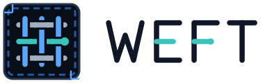

<p align="center">
  <picture>
    <source media="(prefers-color-scheme: dark)" srcset="assets/weft-banner-dark.svg">
    
  </picture>
</p>

- **RingFrame** — your agentic workflow in three acts: ask, eval, seal.
  Everything is an Ask.
- **Weft** — RingFrame in your terminal: your agents in panes, your Asks in
  one list.

Named after woven cloth: RingFrame is the warp, the fixed record; Weft is the
thread carried across it.

## RingFrame

- **Ask** — turn what you want into a prompt, and confirm it before it runs.
- **Eval** — check the work against what you asked.
- **Seal** — record what you decided.

Each act is written to a ledger in your project's `.fab7/rf/`. RingFrame works
on its own as `/rf:ask`, `/rf:eval` and `/rf:seal` inside your harness.

## Weft

Your real harness sessions side by side, with every Ask beside them showing
how far it got. One key takes the next step. Weft has no model of its own: the
harness does the work and RingFrame keeps the record.

## How they work together

1. `A` — ask. You confirm the prompt; Weft types it into the agent you pick.
2. `Ctrl+]` — step into the agent's pane while it works, and back out.
3. `E` — eval, in the same agent or another one.
4. `S` — seal your decision.

Weft never types into an agent without asking you first.

## Install

Requires macOS or Linux, and a supported harness.

```sh
curl -fsSL https://raw.githubusercontent.com/fab7hq/weft/main/install.sh | sh
```

This installs prebuilt `weft` and `ringframe` binaries to `~/.local/bin`
(override with `WEFT_BIN_DIR`), after checking their checksum. Then add the
`rf` plugin to your harness from the
[Fab7 marketplace](https://github.com/fab7hq/fab7), which lists the supported
harnesses and the commands for each.

Run `weft` in a repository, or `weft <dir>`. `U` (↑ update in the title bar)
syncs RingFrame: its configuration, then each harness's marketplace and
plugin, in order, after you press `P`.

`weft update` installs the latest Weft and RingFrame programs. Weft says at the
bottom of the screen when a newer one is out; restarting is yours.

Agents run in a background session, so closing Weft leaves them working.
`weft stop` ends them.

## Learn more

- [What RingFrame is](https://github.com/fab7hq/fab7/blob/main/products/ringframe/docs/product.md),
  and what it will not tell you
- The acts in detail: [Ask](https://github.com/fab7hq/fab7/blob/main/products/ringframe/docs/commands/ask.md),
  [Eval](https://github.com/fab7hq/fab7/blob/main/products/ringframe/docs/commands/eval.md),
  [Seal](https://github.com/fab7hq/fab7/blob/main/products/ringframe/docs/commands/seal.md)
- Changes in each version: [Releases](https://github.com/fab7hq/weft/releases)

## Development

```sh
cargo build
cargo test
cargo run --example wireframe   # the screens, without running an agent
```

`./bin/reinstall-local` builds both binaries, installs them, syncs the
configuration from a `fab7` checkout beside this one, and reinstalls the
plugins, so a change is tested as users will get it:

```sh
./bin/reinstall-local           # every harness
./bin/reinstall-local <harness>  # one harness
./bin/reinstall-local none      # binaries and configuration only
```

## License

Apache-2.0. Part of [Fab7](https://getfab7.com).
